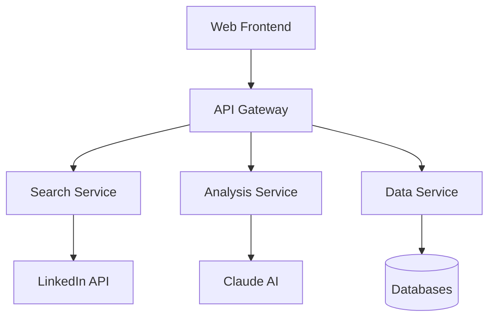

# LinkedIn Profile Search and Analysis System

[](https://github.com/workflow/status)
[](LICENSE)
[](https://github.com/version)
[](https://github.com/security)

An enterprise-grade automated recruitment solution that leverages AI technology to streamline candidate sourcing and evaluation through LinkedIn profile analysis.

## Project Overview

### Introduction

The LinkedIn Profile Search and Analysis System is a comprehensive recruitment automation platform that combines advanced LinkedIn profile discovery with Claude AI-powered candidate evaluation. This system helps recruiters, hiring managers, and HR administrators significantly reduce manual screening effort while improving candidate match quality.

### Key Features

- 🔍 Automated LinkedIn profile discovery and extraction
- 🤖 AI-powered candidate evaluation using Claude
- ⚡ Real-time search and analysis capabilities
- 🔒 Secure profile data management
- 📊 Advanced analytics and reporting
- 🔄 Enterprise system integration
- 📋 Compliance and security features
- 🏗️ Scalable microservices architecture

## System Architecture

### Architecture Overview

The system implements a modern microservices architecture designed for scalability, reliability, and maintainability:



### Core Components

- **Frontend**: React 18+ with Material-UI 5
  - Modern component-based architecture
  - Responsive design
  - Real-time updates

- **API Gateway**: Node.js 18 with Express
  - Request routing and validation
  - Authentication and authorization
  - Rate limiting and security

- **Services**:
  - Search Service (Python 3.11)
  - Analysis Service (Python 3.11)
  - Data Service (Java 17 Spring Boot)

- **Data Layer**:
  - PostgreSQL 15+ (structured data)
  - MongoDB 6.0+ (profile data)
  - Redis 7.0+ (caching)
  - Elasticsearch 8.9+ (search)

## Quick Start

```bash
# Clone the repository
git clone https://github.com/organization/linkedin-profile-search.git

# Install dependencies
npm install    # Frontend
pip install -r requirements.txt  # Python services
./mvnw install  # Java services

# Configure environment
cp .env.example .env
# Edit .env with your configuration

# Start development environment
docker-compose up -d
```

## Development

```bash
# Start frontend development server
cd web/
npm run dev

# Start backend services
cd backend/
docker-compose up -d

# Run tests
npm test        # Frontend
pytest          # Python services
./mvnw test     # Java services
```

## Deployment

```bash
# Build production images
docker-compose -f docker-compose.prod.yml build

# Deploy to production
kubectl apply -f k8s/

# Monitor deployment
kubectl get pods -n production
```

## Security and Compliance

### Security Features

- OAuth 2.0 authentication with MFA
- AES-256 encryption for data at rest
- Role-based access control (RBAC)
- Web Application Firewall (WAF)
- DDoS protection
- Comprehensive audit logging

### Compliance

- GDPR compliance for data privacy
- SOC 2 Type II certified
- ISO 27001 certified
- CCPA compliance
- LinkedIn Terms of Service compliant

## Documentation

- [Contributing Guidelines](CONTRIBUTING.md)
- [Backend Services Documentation](src/backend/README.md)
- [Frontend Application Documentation](src/web/README.md)
- [License Information](LICENSE)

## Support

For technical support or questions:
- 📧 Email: support@organization.com
- 💬 Slack: #linkedin-search-support
- 📝 JIRA: [Project Board](https://organization.atlassian.net)

## License

This project is proprietary software. See the [LICENSE](LICENSE) file for details.

---

© 2023 Organization Name. All rights reserved.