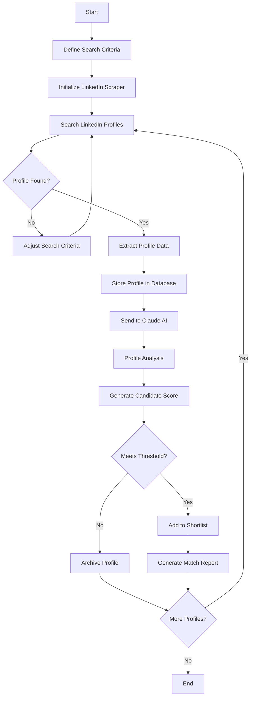
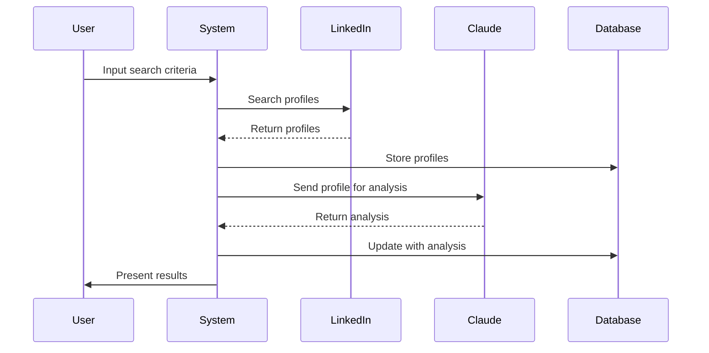
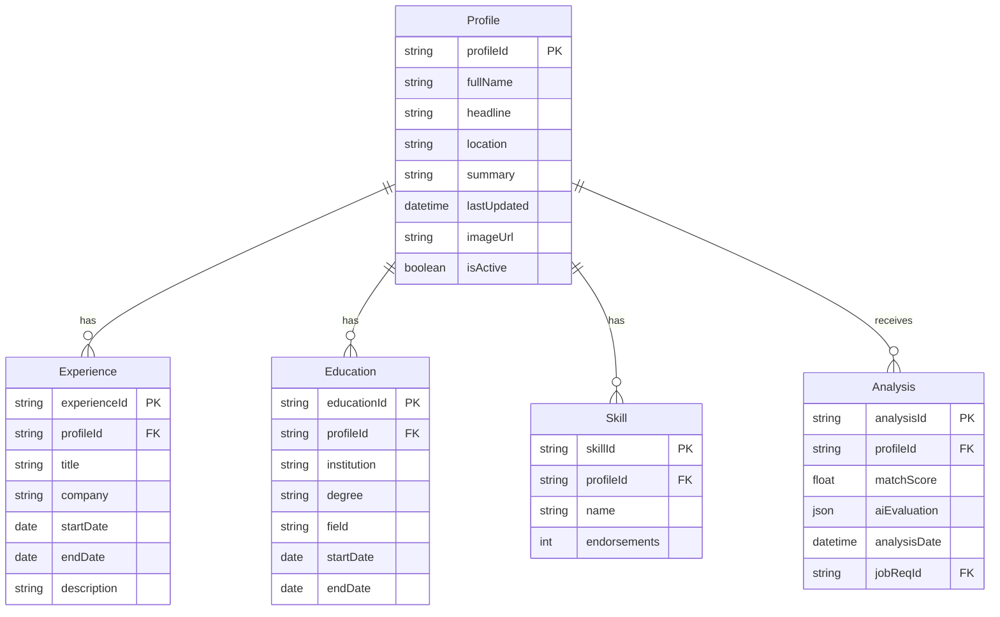
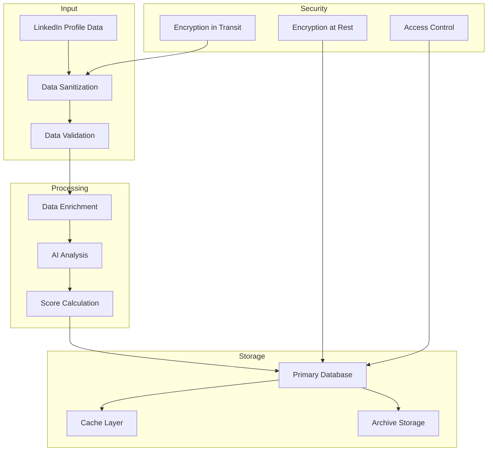
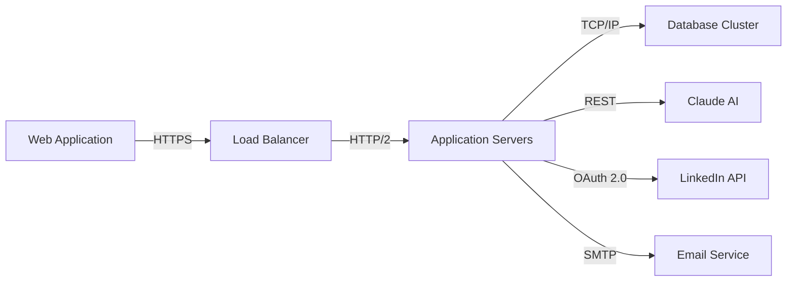

# Product Requirements Document (PRD)

# 1. INTRODUCTION

## 1.1 Purpose
This Product Requirements Document (PRD) specifies the requirements for developing an automated LinkedIn profile search and analysis system. The document is intended for:
- Development team members
- Project managers
- Stakeholders involved in recruitment
- Quality assurance personnel
- System architects and designers

## 1.2 Scope
The system will be a specialized recruitment tool that automates candidate sourcing through LinkedIn profiles. Key aspects include:

- Automated scanning and extraction of LinkedIn profile data
- Integration with Claude AI for candidate evaluation
- Profile matching against job requirements
- Candidate shortlisting based on predefined criteria

Core functionalities:
- LinkedIn profile data scraping and collection
- Secure storage of candidate information
- AI-powered profile analysis using Claude
- Candidate scoring and ranking system
- Automated candidate shortlisting
- Compliance with LinkedIn's terms of service and data privacy regulations

The system aims to:
- Reduce manual effort in candidate sourcing
- Improve candidate matching accuracy
- Accelerate the recruitment process
- Provide data-driven candidate recommendations
- Ensure consistent evaluation criteria

# 2. PRODUCT DESCRIPTION

## 2.1 Product Perspective
The LinkedIn Profile Search and Analysis System operates as a standalone recruitment tool that interfaces with:
- LinkedIn's public profile data
- Claude AI API for profile analysis
- Local/cloud database for profile storage
- Existing Applicant Tracking Systems (ATS) through API integration

The system architecture follows a modular design with these key components:
- Web scraping module
- Data processing engine
- AI analysis interface
- Secure database
- User interface dashboard

## 2.2 Product Functions
- Profile Search and Collection
  - Automated LinkedIn profile discovery based on search criteria
  - Batch profile data extraction
  - Profile information parsing and structuring

- AI-Powered Analysis
  - Natural language processing of profile content
  - Skills and experience mapping
  - Candidate-role compatibility scoring
  - Red flag identification

- Data Management
  - Secure profile storage
  - Version control for profile updates
  - Data export capabilities
  - Compliance audit logging

- Reporting and Analytics
  - Candidate ranking visualization
  - Talent pool analytics
  - Search effectiveness metrics
  - Custom report generation

## 2.3 User Characteristics
Primary Users:
1. Recruiters
   - Technical proficiency: Intermediate
   - Domain expertise: High in recruitment
   - Usage frequency: Daily
   - Key needs: Efficient candidate sourcing, accurate matching

2. Hiring Managers
   - Technical proficiency: Basic to intermediate
   - Domain expertise: High in specific field
   - Usage frequency: Weekly
   - Key needs: Candidate quality assessment, team fit evaluation

3. HR Administrators
   - Technical proficiency: Intermediate
   - Domain expertise: High in HR processes
   - Usage frequency: Regular
   - Key needs: System management, compliance monitoring

## 2.4 Constraints
Technical Constraints:
- LinkedIn's rate limiting and anti-scraping measures
- API call limitations for Claude AI
- Data storage capacity limits
- Processing speed requirements

Legal Constraints:
- GDPR and data privacy regulations
- LinkedIn terms of service compliance
- Employment law requirements
- Data retention policies

Resource Constraints:
- API usage costs
- Infrastructure expenses
- Development team size
- Timeline limitations

## 2.5 Assumptions and Dependencies
Assumptions:
- LinkedIn's public profile structure remains stable
- Claude AI maintains consistent API availability
- Users have basic technical literacy
- Internet connectivity is reliable
- Profile data remains accurate and current

Dependencies:
- LinkedIn platform availability
- Claude AI service continuity
- Cloud infrastructure services
- Database management systems
- Network infrastructure reliability
- Third-party API services
- Security certificate providers

# 3. PROCESS FLOWCHART

```mermaid
flowchart TD
    subgraph AI_Analysis
    I1[Receive Profile] --> I2[Parse Experience]
    I2 --> I3[Analyze Skills]
    I3 --> I4[Check Requirements Match]
    I4 --> I5[Calculate Score]
    end

    subgraph Data_Storage
    D1[Profile Data] --> D2[Candidate Metrics]
    D2 --> D3[Analysis Results]
    D3 --> D4[Match Reports]
    end

    subgraph User_Interface
    U1[Search Configuration] --> U2[Results Dashboard]
    U2 --> U3[Candidate Rankings]
    U3 --> U4[Export Reports]
    end
```

# 4. FUNCTIONAL REQUIREMENTS

## 4.1 LinkedIn Profile Search Engine

### ID: F001
### Description
Automated system to search and discover LinkedIn profiles based on configurable search criteria
### Priority: High
### Requirements Table

| Requirement ID | Description | Priority |
|---------------|-------------|----------|
| F001.1 | Support boolean search operators (AND, OR, NOT) | High |
| F001.2 | Filter by location, industry, and experience level | High |
| F001.3 | Save and reuse search templates | Medium |
| F001.4 | Handle multiple concurrent searches | Medium |
| F001.5 | Implement rate limiting compliance | High |

## 4.2 Profile Data Extraction

### ID: F002
### Description
Automated extraction and parsing of LinkedIn profile information
### Priority: High
### Requirements Table

| Requirement ID | Description | Priority |
|---------------|-------------|----------|
| F002.1 | Extract professional experience details | High |
| F002.2 | Capture education and certifications | High |
| F002.3 | Parse skills and endorsements | High |
| F002.4 | Store profile images and media | Low |
| F002.5 | Track profile update history | Medium |

## 4.3 Claude AI Integration

### ID: F003
### Description
Integration with Claude AI for profile analysis and evaluation
### Priority: High
### Requirements Table

| Requirement ID | Description | Priority |
|---------------|-------------|----------|
| F003.1 | Format profiles for Claude API compatibility | High |
| F003.2 | Process Claude's analysis results | High |
| F003.3 | Handle API errors and retries | High |
| F003.4 | Cache analysis results | Medium |
| F003.5 | Version control for AI models | Medium |

## 4.4 Candidate Scoring System

### ID: F004
### Description
Automated scoring and ranking of candidates based on job requirements
### Priority: High
### Requirements Table

| Requirement ID | Description | Priority |
|---------------|-------------|----------|
| F004.1 | Calculate match percentage | High |
| F004.2 | Weight different criteria | High |
| F004.3 | Generate detailed scoring breakdown | Medium |
| F004.4 | Support custom scoring rules | Medium |
| F004.5 | Compare candidates within search results | High |

## 4.5 Data Management

### ID: F005
### Description
Secure storage and management of profile data and analysis results
### Priority: High
### Requirements Table

| Requirement ID | Description | Priority |
|---------------|-------------|----------|
| F005.1 | Implement GDPR-compliant storage | High |
| F005.2 | Automated data retention policies | High |
| F005.3 | Data export functionality | Medium |
| F005.4 | Backup and recovery systems | High |
| F005.5 | Access control and audit logging | High |

## 4.6 Reporting System

### ID: F006
### Description
Generation of comprehensive reports and analytics
### Priority: Medium
### Requirements Table

| Requirement ID | Description | Priority |
|---------------|-------------|----------|
| F006.1 | Generate candidate shortlist reports | High |
| F006.2 | Create search analytics dashboards | Medium |
| F006.3 | Export reports in multiple formats | Medium |
| F006.4 | Schedule automated reports | Low |
| F006.5 | Customize report templates | Medium |

# 5. NON-FUNCTIONAL REQUIREMENTS

## 5.1 Performance Requirements

| Requirement ID | Description | Target Metric |
|---------------|-------------|---------------|
| P001 | Profile search response time | < 3 seconds per search |
| P002 | Profile data extraction speed | < 5 seconds per profile |
| P003 | Claude AI analysis time | < 10 seconds per profile |
| P004 | Database query response time | < 1 second |
| P005 | Concurrent user support | 100 simultaneous users |
| P006 | System memory usage | < 4GB RAM |
| P007 | API throughput | 1000 requests/hour |
| P008 | Data processing capacity | 10,000 profiles/day |

## 5.2 Safety Requirements

| Requirement ID | Description | Priority |
|---------------|-------------|----------|
| S001 | Automated system backup every 24 hours | High |
| S002 | Failover system for critical components | High |
| S003 | Data recovery point objective (RPO) | < 1 hour |
| S004 | Recovery time objective (RTO) | < 4 hours |
| S005 | Automatic error logging and alerting | High |
| S006 | Graceful degradation of services | Medium |

## 5.3 Security Requirements

| Requirement ID | Description | Priority |
|---------------|-------------|----------|
| SE001 | Multi-factor authentication | High |
| SE002 | Role-based access control (RBAC) | High |
| SE003 | End-to-end data encryption (AES-256) | High |
| SE004 | Secure API endpoints with OAuth 2.0 | High |
| SE005 | Regular security audits | Medium |
| SE006 | Intrusion detection system | High |
| SE007 | Session timeout after 30 minutes | Medium |
| SE008 | Password policy enforcement | High |

## 5.4 Quality Requirements

### 5.4.1 Availability
- System uptime: 99.9%
- Planned maintenance windows: < 4 hours/month
- Service availability monitoring
- Automated health checks every 5 minutes

### 5.4.2 Maintainability
- Modular architecture design
- Comprehensive API documentation
- Code coverage > 80%
- Automated deployment pipeline
- Version control for all components

### 5.4.3 Usability
- Intuitive user interface design
- Maximum 3 clicks to major functions
- Response to user actions < 1 second
- Comprehensive help documentation
- Multi-language support

### 5.4.4 Scalability
- Horizontal scaling capability
- Auto-scaling based on load
- Database partitioning support
- Load balancing across servers
- Microservices architecture

### 5.4.5 Reliability
- Mean time between failures (MTBF) > 720 hours
- Error rate < 0.1%
- Automated error recovery
- Data consistency checks
- Regular system health reports

## 5.5 Compliance Requirements

| Requirement ID | Description | Priority |
|---------------|-------------|----------|
| C001 | GDPR compliance for EU data | High |
| C002 | CCPA compliance for California residents | High |
| C003 | LinkedIn platform terms of service adherence | High |
| C004 | SOC 2 Type II certification | Medium |
| C005 | ISO 27001 compliance | Medium |
| C006 | Data retention policy compliance | High |
| C007 | Regular compliance audits | Medium |
| C008 | Privacy policy implementation | High |

# 6. DATA REQUIREMENTS

## 6.1 Data Models

## 6.2 Data Storage

### 6.2.1 Primary Storage
| Storage Type | Purpose | Specifications |
|--------------|---------|----------------|
| PostgreSQL | Profile data and relationships | High-availability cluster |
| MongoDB | AI analysis results and unstructured data | Sharded cluster |
| Redis | Cache and session management | In-memory cluster |
| S3 | Profile media and document storage | Multi-region buckets |

### 6.2.2 Data Retention
| Data Type | Retention Period | Archive Strategy |
|-----------|------------------|------------------|
| Active profiles | 2 years | Cold storage after 1 year |
| Analysis results | 1 year | Compressed archive |
| Search logs | 6 months | Aggregate and archive |
| User activity | 1 year | Periodic archival |

### 6.2.3 Backup and Recovery
- Daily incremental backups
- Weekly full backups
- Cross-region replication
- Point-in-time recovery capability
- 30-day backup retention
- 15-minute Recovery Point Objective (RPO)

## 6.3 Data Processing

### 6.3.1 Data Security Measures
| Security Layer | Implementation |
|----------------|----------------|
| Encryption | AES-256 for data at rest |
| Transport | TLS 1.3 for data in transit |
| Access Control | Row-level security in PostgreSQL |
| Masking | PII data masking in non-prod environments |
| Audit | Comprehensive audit logging |

### 6.3.2 Data Processing Requirements
| Requirement | Specification |
|-------------|---------------|
| Throughput | 100 profiles/minute |
| Latency | < 500ms for data retrieval |
| Concurrency | 50 simultaneous processing threads |
| Queue Size | 10,000 profile buffer |
| Batch Size | 1,000 profiles per batch |

### 6.3.3 Data Quality Controls
- Duplicate detection and merging
- Data format validation
- Mandatory field checks
- Data consistency verification
- Regular data quality audits
- Automated data cleansing

# 7. EXTERNAL INTERFACES

## 7.1 User Interfaces

### 7.1.1 Web Dashboard Interface
| Component | Description | Requirements |
|-----------|-------------|--------------|
| Search Panel | Advanced search configuration | Responsive design, support for boolean operators |
| Results Grid | Paginated profile listing | Sortable columns, infinite scroll |
| Profile View | Detailed candidate information | Tabbed layout, collapsible sections |
| Analytics Dashboard | Visual metrics and reports | Interactive charts, exportable data |
| Settings Panel | System configuration | Form validation, real-time updates |

### 7.1.2 Mobile Interface
| Component | Description | Requirements |
|-----------|-------------|--------------|
| Search View | Simplified search interface | Touch-optimized, gesture support |
| Profile Cards | Candidate summary cards | Swipe navigation, quick actions |
| Notifications | Alert system | Push notifications, status updates |

## 7.2 Software Interfaces

### 7.2.1 External APIs
| Interface | Protocol | Data Format | Purpose |
|-----------|----------|-------------|----------|
| LinkedIn API | REST/OAuth 2.0 | JSON | Profile data access |
| Claude AI API | REST | JSON | Profile analysis |
| Cloud Storage API | S3 API | Binary/JSON | Media storage |
| Email Service API | SMTP/REST | MIME/JSON | Notifications |

### 7.2.2 Database Interfaces
| Interface | Protocol | Purpose |
|-----------|----------|----------|
| PostgreSQL | TCP/IP | Primary data storage |
| MongoDB | TCP/IP | Unstructured data storage |
| Redis | TCP/IP | Caching and sessions |

## 7.3 Communication Interfaces

### 7.3.1 Network Protocols
| Protocol | Port | Usage |
|----------|------|-------|
| HTTPS | 443 | Web interface access |
| WebSocket | 443 | Real-time updates |
| TLS 1.3 | Various | Secure communication |

### 7.3.2 Data Exchange Formats
| Format | Usage | Validation |
|--------|-------|------------|
| JSON | API responses | JSON Schema |
| CSV | Data export | RFC 4180 |
| XML | Legacy system integration | XSD Schema |

### 7.3.3 Integration Points

## 7.4 Hardware Interfaces

### 7.4.1 Server Requirements
| Component | Specification |
|-----------|--------------|
| CPU | 8+ cores, x86_64 architecture |
| Memory | 32GB+ RAM |
| Storage | SSD, RAID 10 configuration |
| Network | 10Gbps NIC |

### 7.4.2 Client Requirements
| Device Type | Minimum Specifications |
|-------------|----------------------|
| Desktop | Modern browser, 4GB RAM |
| Mobile | iOS 14+ or Android 10+ |
| Tablet | iPad OS 14+ or Android 10+ |

# 8. APPENDICES

## 8.1 GLOSSARY

| Term | Definition |
|------|------------|
| Boolean Search | A type of search allowing users to combine keywords with operators like AND, OR, and NOT |
| Cold Storage | Low-cost storage solution for infrequently accessed data |
| Data Retention | The period for which data is kept before being archived or deleted |
| Endorsement | LinkedIn feature where connections validate a user's skills |
| Rate Limiting | Controlling the number of requests made to an API within a time period |
| Row-Level Security | Database feature that restricts which rows users can access |
| Sharding | Database partitioning that separates large databases into smaller, faster parts |
| Shortlisting | Process of selecting candidates that best match job requirements |

## 8.2 ACRONYMS

| Acronym | Definition |
|---------|------------|
| AES | Advanced Encryption Standard |
| API | Application Programming Interface |
| ATS | Applicant Tracking System |
| CCPA | California Consumer Privacy Act |
| GDPR | General Data Protection Regulation |
| MTBF | Mean Time Between Failures |
| NIC | Network Interface Card |
| OAuth | Open Authorization |
| PII | Personally Identifiable Information |
| RAID | Redundant Array of Independent Disks |
| RBAC | Role-Based Access Control |
| REST | Representational State Transfer |
| RPO | Recovery Point Objective |
| RTO | Recovery Time Objective |
| S3 | Simple Storage Service |
| SMTP | Simple Mail Transfer Protocol |
| SOC | System and Organization Controls |
| TLS | Transport Layer Security |
| XSD | XML Schema Definition |

## 8.3 ADDITIONAL REFERENCES

| Reference | Description | URL |
|-----------|-------------|-----|
| LinkedIn API Documentation | Official API documentation for LinkedIn platform | https://docs.microsoft.com/linkedin/ |
| Claude AI Documentation | API documentation for Claude integration | https://docs.anthropic.com/claude/ |
| GDPR Guidelines | Official EU GDPR compliance documentation | https://gdpr.eu/documents/ |
| PostgreSQL Documentation | Database implementation reference | https://www.postgresql.org/docs/ |
| OAuth 2.0 Specification | Authentication protocol specification | https://oauth.net/2/ |
| RFC 4180 | CSV File Format Specification | https://tools.ietf.org/html/rfc4180 |
| ISO 27001 | Information security standard | https://www.iso.org/isoiec-27001-information-security.html |
| WebSocket Protocol | Real-time communication specification | https://tools.ietf.org/html/rfc6455 |