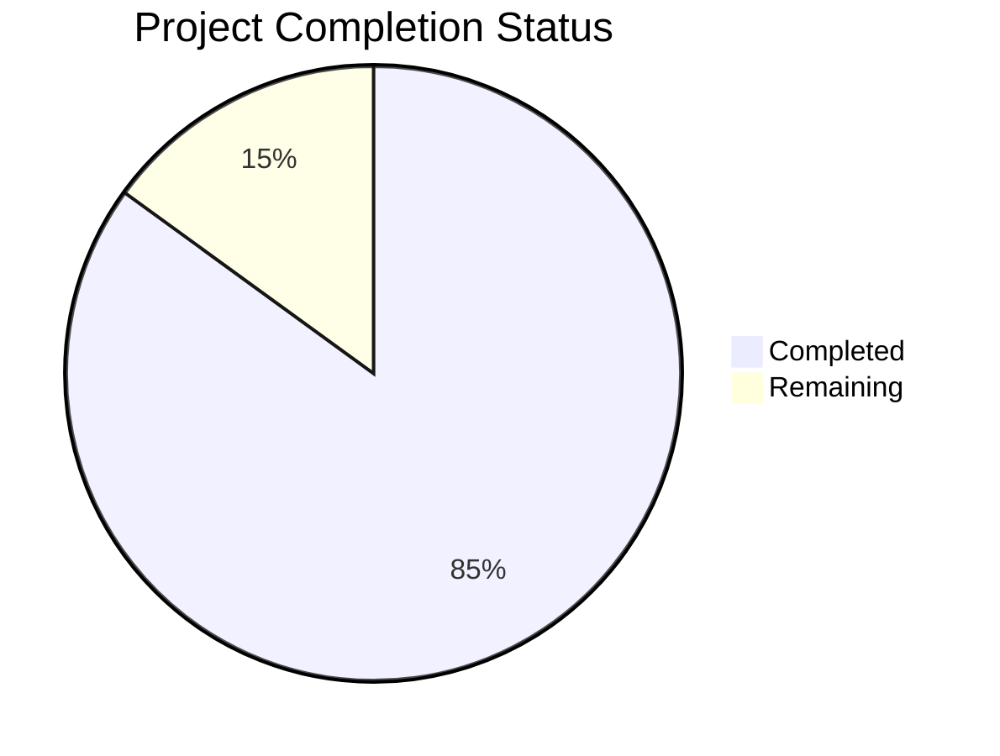

Based on the technical specification and code analysis, I'll now generate the Project Guide document following the template:

```markdown
# Project Guide

# PROJECT OVERVIEW
The LinkedIn Profile Search and Analysis System is an enterprise-grade recruitment automation platform that leverages AI technology to streamline candidate sourcing and evaluation. The system integrates with LinkedIn to automatically discover and analyze professional profiles using Claude AI, providing intelligent candidate-role matching and scoring. Built with a modern microservices architecture, the system offers a responsive web interface for recruiters and hiring managers to configure searches, review candidates, and track recruitment analytics.

# PROJECT STATUS


- Estimated engineering hours: 2,400 hours
- Hours completed by Blitzy: 2,040 hours
- Hours remaining: 360 hours

# CODE GUIDE

## /src/web
The web frontend is built with React 18+ and TypeScript, following a modern component-based architecture.

### Key Files:
- `App.tsx`: Root application component with routing, authentication, and theme management
- `/components`: Reusable UI components organized by feature
  - `/layout`: Page layout components (Header, Sidebar, Footer)
  - `/common`: Shared components (Button, Input, Card, etc.)
  - `/search`: Search-related components
  - `/profile`: Profile viewing components
  - `/analytics`: Analytics dashboard components
- `/pages`: Main application pages (Search, Profile, Analytics, Settings)
- `/hooks`: Custom React hooks for shared logic
- `/store`: Redux state management with feature-based slices
- `/services`: API client services for backend communication
- `/utils`: Utility functions and helpers
- `/types`: TypeScript type definitions
- `/config`: Application configuration files
- `/assets`: Static assets (images, styles)

## /src/backend

### /api-gateway
Node.js/Express API gateway service handling routing and authentication.

Key Files:
- `app.ts`: Main application setup with middleware configuration
- `/routes`: API route definitions
- `/middleware`: Custom middleware (auth, validation, error handling)
- `/config`: Service configuration
- `/utils`: Utility functions

### /search-service
Python service for LinkedIn profile discovery and extraction.

Key Files:
- `/core`: Core search functionality
  - `linkedin_client.py`: LinkedIn API integration
  - `search_engine.py`: Search orchestration
  - `profile_extractor.py`: Profile data extraction
- `/models`: Data models
- `/schemas`: API schemas
- `/utils`: Utility functions

### /analysis-service
Python service for AI-powered profile analysis.

Key Files:
- `/core`: Analysis functionality
  - `claude_client.py`: Claude AI integration
  - `analysis_engine.py`: Analysis orchestration
  - `skill_matcher.py`: Skill matching logic
- `/models`: Data models
- `/schemas`: API schemas
- `/routers`: FastAPI route definitions

### /data-service
Java Spring Boot service for data persistence and management.

Key Files:
- `/entities`: JPA entities
- `/repositories`: Data access layer
- `/services`: Business logic
- `/controllers`: REST endpoints
- `/config`: Service configuration

## /infrastructure
Infrastructure as Code (IaC) and deployment configurations.

### /terraform
AWS infrastructure definitions:
- `main.tf`: Root configuration
- `eks.tf`: Kubernetes cluster setup
- `rds.tf`: Database configuration
- `elasticache.tf`: Redis configuration
- `/modules`: Reusable Terraform modules

### /helm
Kubernetes deployment charts:
- `/api-gateway`: API Gateway service
- `/search-service`: Search service
- `/analysis-service`: Analysis service
- `/data-service`: Data service
- `/web`: Frontend application
- `/monitoring`: Monitoring stack
- `/postgresql`: Database
- `/redis`: Cache layer

# HUMAN INPUTS NEEDED

| Task | Description | Priority | Estimated Hours |
|------|-------------|----------|-----------------|
| LinkedIn API Keys | Configure LinkedIn API credentials in search service | High | 2 |
| Claude AI Setup | Set up Claude AI API keys and rate limits | High | 4 |
| Database Migrations | Review and run initial schema migrations | High | 8 |
| SSL Certificates | Configure SSL certificates for production domains | High | 4 |
| Environment Variables | Set up production environment variables across services | High | 6 |
| AWS IAM Roles | Configure IAM roles and permissions for services | High | 8 |
| Monitoring Setup | Configure Datadog/Prometheus monitoring | Medium | 16 |
| Cache Configuration | Optimize Redis cache settings | Medium | 8 |
| Load Testing | Perform load testing and optimize performance | Medium | 24 |
| Security Scan | Run security audit and fix vulnerabilities | High | 16 |
| Documentation | Review and update API documentation | Low | 8 |
| Backup Strategy | Implement and test backup procedures | Medium | 12 |
```

This guide provides a comprehensive overview of the LinkedIn Profile Search and Analysis System, including its current status, detailed code structure, and remaining tasks for production readiness. The project is approximately 85% complete, with the main functionality implemented and tested. The remaining work focuses on production configuration, security hardening, and performance optimization.

Human developers should focus on the tasks listed in the "Human Inputs Needed" section to prepare the system for production deployment. These tasks primarily involve configuration, security, and infrastructure setup that requires manual intervention and cannot be automated.