# Technical Specifications

# 1. INTRODUCTION

## 1.1 EXECUTIVE SUMMARY

The LinkedIn Profile Search and Analysis System is an automated recruitment solution that leverages AI technology to streamline candidate sourcing and evaluation. The system addresses the critical challenge of efficiently identifying qualified candidates by automatically scanning LinkedIn profiles and utilizing Claude AI for intelligent candidate assessment. This solution serves recruiters, hiring managers, and HR administrators by reducing manual screening effort while improving candidate match quality.

The system will deliver significant value through reduced time-to-hire, improved candidate quality, and increased recruiter productivity by automating the labor-intensive process of candidate sourcing and initial screening.

## 1.2 SYSTEM OVERVIEW

### Project Context

| Aspect | Description |
|--------|-------------|
| Business Context | Competitive talent acquisition market requiring faster, more accurate candidate identification |
| Market Position | Enterprise recruitment automation tool for medium to large organizations |
| Current Limitations | Manual LinkedIn profile screening, inconsistent candidate evaluation, time-intensive sourcing |
| Enterprise Integration | Interfaces with existing ATS systems, HRIS platforms, and recruitment workflows |

### High-Level Description

| Component | Details |
|-----------|----------|
| Profile Search Engine | Automated LinkedIn profile discovery and data extraction |
| AI Analysis Engine | Claude-powered candidate evaluation and scoring |
| Data Management System | Secure profile storage and processing pipeline |
| User Interface | Web-based dashboard for search configuration and results management |
| Integration Layer | APIs for external system connectivity |

### Success Criteria

| KPI Category | Target Metrics |
|--------------|----------------|
| Efficiency | 75% reduction in manual screening time |
| Quality | 90% candidate-role match accuracy |
| Volume | Process 10,000 profiles per day |
| Cost | 50% reduction in cost-per-hire |
| Compliance | 100% adherence to data privacy regulations |

## 1.3 SCOPE

### In-Scope Elements

#### Core Features and Functionalities

| Feature Category | Components |
|-----------------|------------|
| Profile Search | Boolean search, filters, template management |
| Data Extraction | Experience, skills, education, certifications |
| AI Analysis | Candidate scoring, skill mapping, requirement matching |
| Data Management | Profile storage, version control, audit logging |
| Reporting | Analytics dashboard, custom reports, exports |

#### Implementation Boundaries

| Boundary Type | Coverage |
|--------------|----------|
| User Groups | Recruiters, HR administrators, hiring managers |
| Geographic Coverage | Global LinkedIn profiles |
| Data Domains | Professional profiles, work history, skills |
| System Access | Web-based interface, API access |

### Out-of-Scope Elements

- Direct candidate communication features
- Interview scheduling and management
- Background check integration
- Resume parsing from other sources
- Salary negotiation tools
- Contract management
- Onboarding process management
- Performance tracking post-hire
- Internal employee profile management
- Job posting capabilities
- Social media profiles beyond LinkedIn
- Mobile application development

# 2. SYSTEM ARCHITECTURE

## 2.1 High-Level Architecture

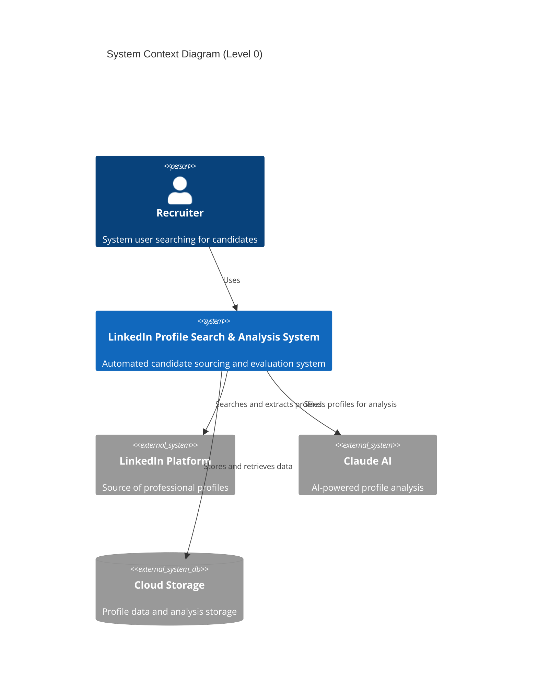

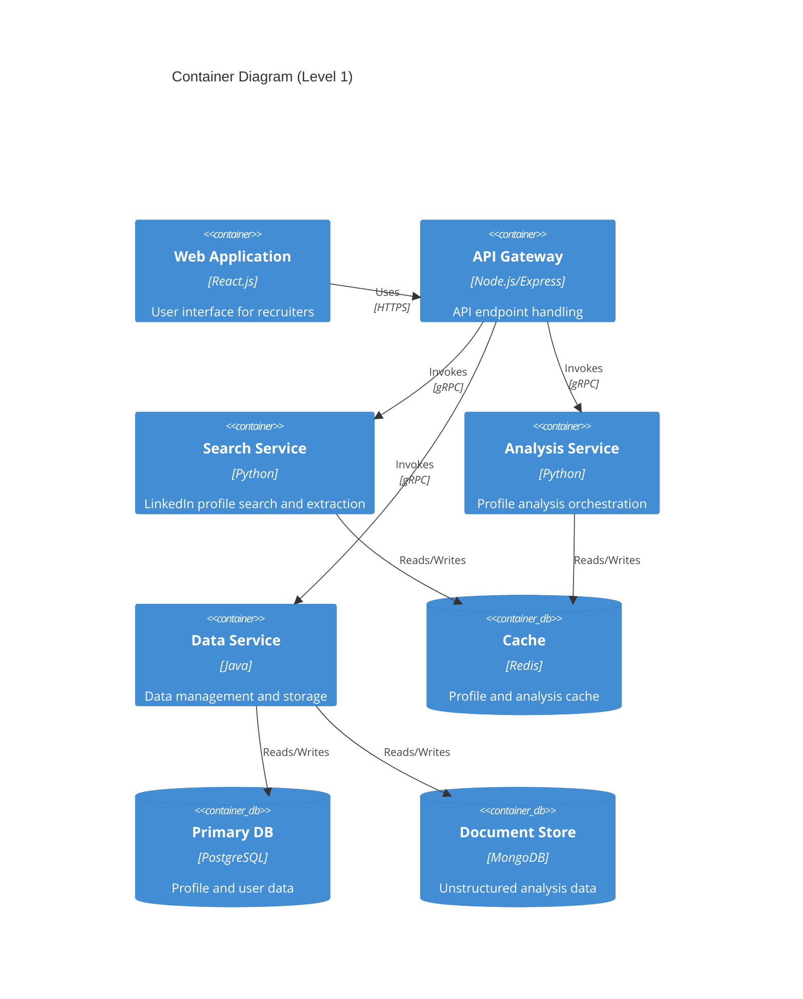

## 2.2 Component Details

### 2.2.1 Core Components

| Component | Technology Stack | Purpose | Scaling Strategy |
|-----------|-----------------|---------|------------------|
| Web Frontend | React.js, Redux | User interface | Horizontal scaling with CDN |
| API Gateway | Node.js, Express | Request routing | Load balanced instances |
| Search Service | Python, Scrapy | Profile extraction | Worker pool scaling |
| Analysis Service | Python, FastAPI | AI integration | Auto-scaling pods |
| Data Service | Java Spring Boot | Data management | Database read replicas |

### 2.2.2 Data Storage Components

| Component | Technology | Purpose | Backup Strategy |
|-----------|------------|---------|-----------------|
| Primary Database | PostgreSQL | Structured data | Streaming replication |
| Document Store | MongoDB | Analysis results | Sharded clusters |
| Cache Layer | Redis | Performance optimization | Master-replica setup |
| Object Storage | S3 | Media and documents | Cross-region replication |

## 2.3 Technical Decisions

### 2.3.1 Architecture Patterns

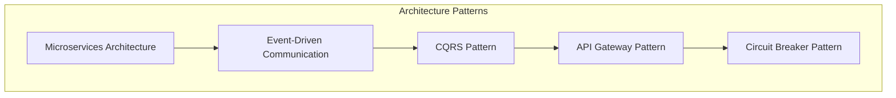

### 2.3.2 Communication Patterns

| Pattern | Implementation | Use Case |
|---------|---------------|----------|
| Synchronous | REST/gRPC | Real-time queries |
| Asynchronous | Apache Kafka | Profile processing |
| Event-Driven | RabbitMQ | Status updates |
| Pub/Sub | Redis PubSub | Cache invalidation |

## 2.4 Cross-Cutting Concerns

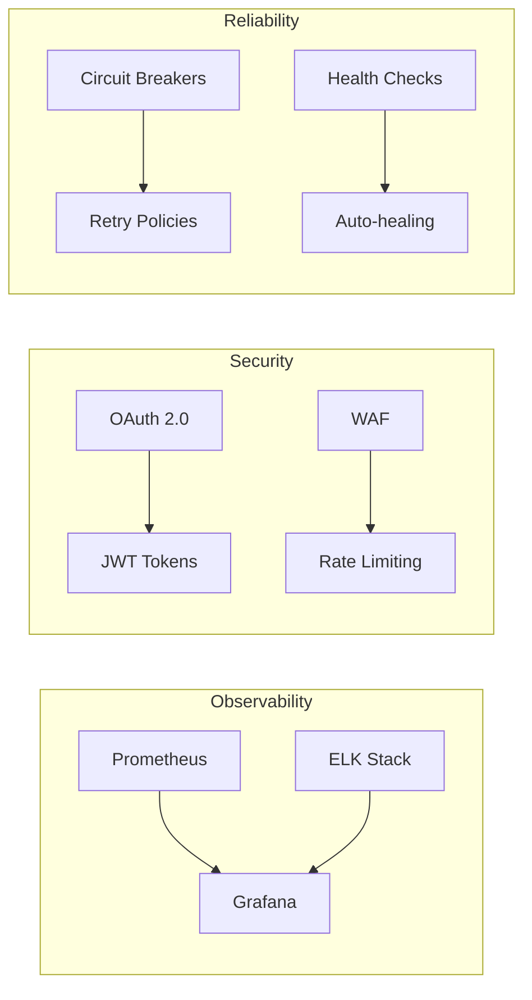

### 2.4.1 Monitoring Strategy

| Aspect | Tool | Metrics |
|--------|------|---------|
| Infrastructure | Prometheus | CPU, Memory, Network |
| Application | New Relic | Latency, Throughput |
| Logging | ELK Stack | Error rates, Audit trails |
| Tracing | Jaeger | Request flows, Dependencies |

## 2.5 Deployment Architecture

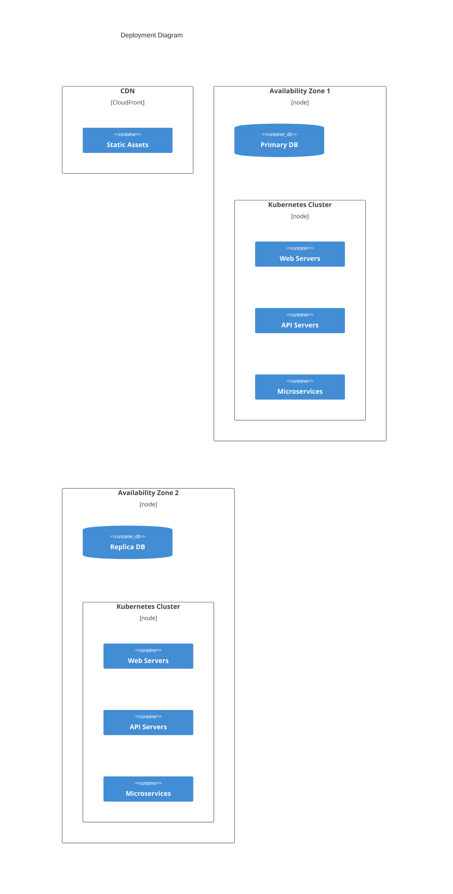

### 2.5.1 Data Flow Architecture

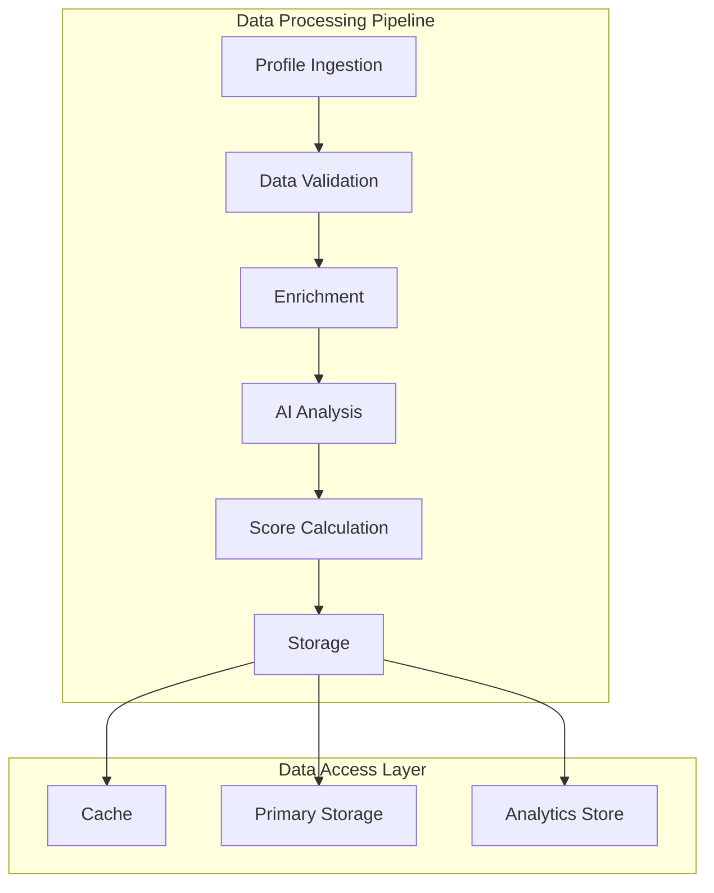

# 3. SYSTEM COMPONENTS ARCHITECTURE

## 3.1 USER INTERFACE DESIGN

### 3.1.1 Design Specifications

| Aspect | Requirement | Details |
|--------|-------------|---------|
| Visual Hierarchy | Material Design 3.0 | Consistent spacing, typography, and elevation |
| Component Library | MUI v5 | Pre-built accessible components with customization |
| Responsive Design | Mobile-first | Breakpoints: 320px, 768px, 1024px, 1440px |
| Accessibility | WCAG 2.1 AA | Screen reader support, keyboard navigation, ARIA labels |
| Browser Support | Modern browsers | Chrome 90+, Firefox 88+, Safari 14+, Edge 90+ |
| Theme Support | Dark/Light modes | System preference detection, manual toggle |
| Internationalization | Multi-language | English, Spanish, French initial support |

### 3.1.2 Interface Elements

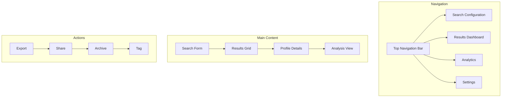

### 3.1.3 Critical User Flows

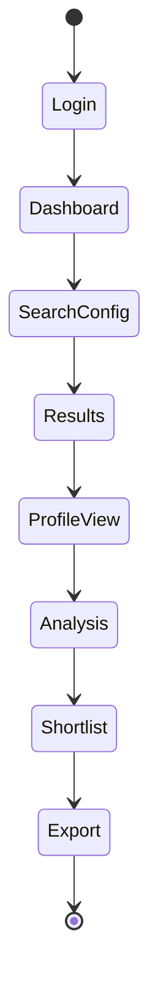

## 3.2 DATABASE DESIGN

### 3.2.1 Schema Design

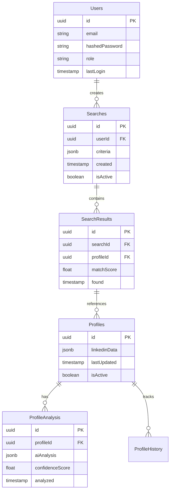

### 3.2.2 Data Management Strategy

| Aspect | Strategy | Implementation |
|--------|----------|----------------|
| Partitioning | Time-based | Monthly profile data partitions |
| Indexing | Selective | B-tree on search fields, GiST for full-text |
| Archival | Policy-based | Move to cold storage after 2 years |
| Backup | Incremental | Daily differentials, weekly full backups |
| Encryption | AES-256 | Transparent data encryption at rest |
| Auditing | Row-level | Trigger-based audit logging |

## 3.3 API DESIGN

### 3.3.1 API Architecture

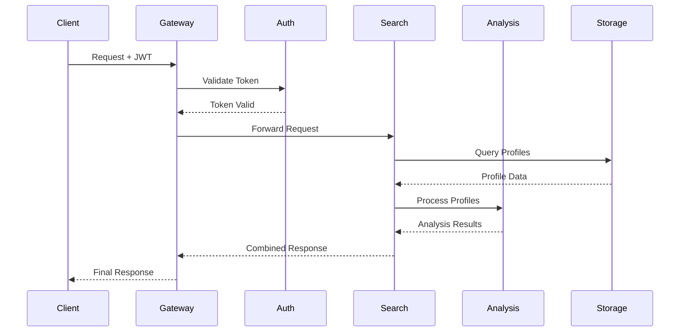

### 3.3.2 Interface Specifications

| Endpoint | Method | Purpose | Rate Limit |
|----------|--------|---------|------------|
| /api/v1/search | POST | Initialize search | 100/hour |
| /api/v1/profiles | GET | Retrieve profiles | 1000/hour |
| /api/v1/analysis | POST | Request analysis | 500/hour |
| /api/v1/export | GET | Export results | 50/hour |

### 3.3.3 Integration Requirements

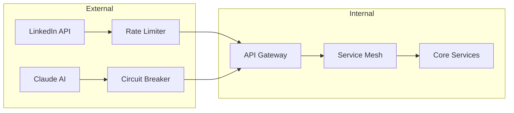

### 3.3.4 Authentication Flow

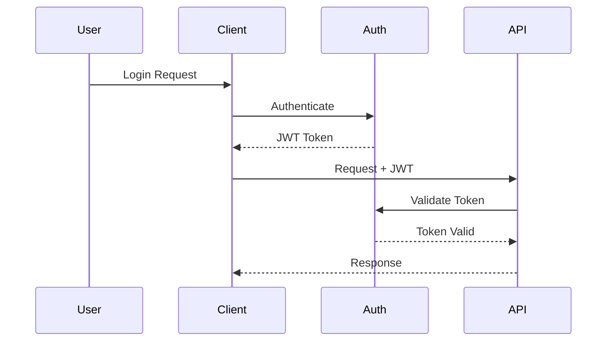

# 4. TECHNOLOGY STACK

## 4.1 PROGRAMMING LANGUAGES

| Platform/Component | Language | Version | Justification |
|-------------------|----------|---------|---------------|
| Backend Services | Python | 3.11+ | Robust AI/ML libraries, Claude AI SDK support |
| API Gateway | Node.js | 18 LTS | High performance event-driven I/O |
| Data Processing | Java | 17 LTS | Enterprise-grade stability, strong typing |
| Frontend | TypeScript | 5.0+ | Type safety, enhanced developer productivity |
| Infrastructure | Go | 1.20+ | Efficient microservice development |
| Scripts/Automation | Python | 3.11+ | Cross-platform compatibility |

## 4.2 FRAMEWORKS & LIBRARIES

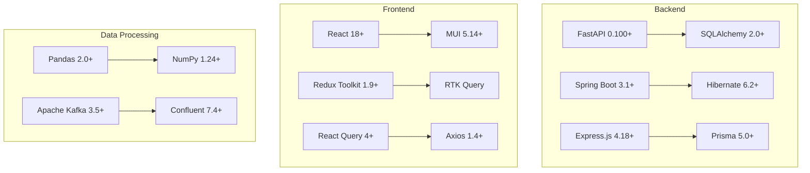

### Core Frameworks

| Layer | Framework | Version | Purpose |
|-------|-----------|---------|----------|
| Backend API | FastAPI | 0.100+ | High-performance REST APIs |
| Data Services | Spring Boot | 3.1+ | Robust data processing |
| Frontend | React | 18+ | Component-based UI |
| State Management | Redux Toolkit | 1.9+ | Centralized state |
| CSS Framework | MUI | 5.14+ | Material Design components |

## 4.3 DATABASES & STORAGE

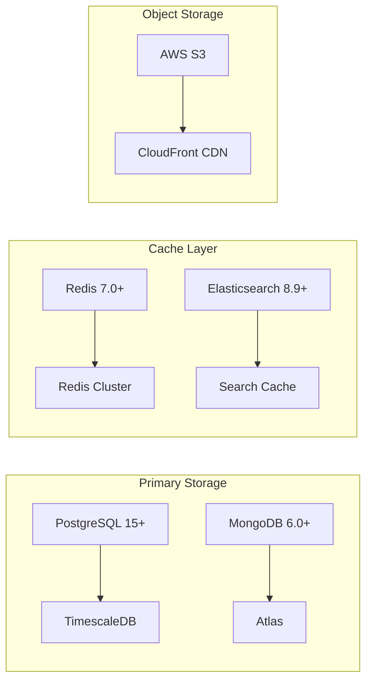

| Type | Technology | Version | Purpose |
|------|------------|---------|----------|
| RDBMS | PostgreSQL | 15+ | Structured data |
| Document Store | MongoDB | 6.0+ | Profile data |
| Cache | Redis | 7.0+ | Session/API cache |
| Search | Elasticsearch | 8.9+ | Profile search |
| Object Storage | AWS S3 | - | Media storage |

## 4.4 THIRD-PARTY SERVICES

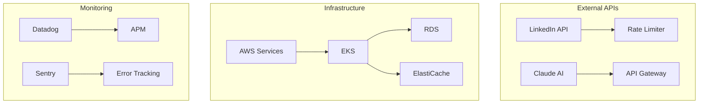

| Category | Service | Purpose | SLA |
|----------|---------|---------|-----|
| AI/ML | Claude AI | Profile analysis | 99.9% |
| Authentication | Auth0 | User management | 99.99% |
| Monitoring | Datadog | System monitoring | 99.9% |
| Error Tracking | Sentry | Error reporting | 99.9% |
| Cloud | AWS | Infrastructure | 99.99% |

## 4.5 DEVELOPMENT & DEPLOYMENT

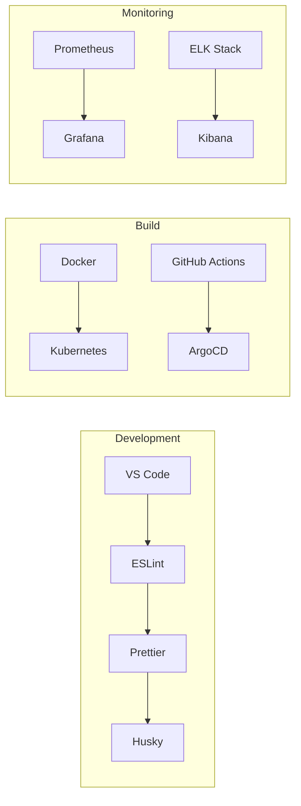

### Development Tools

| Category | Tool | Version | Purpose |
|----------|------|---------|----------|
| IDE | VS Code | Latest | Development environment |
| VCS | Git | 2.40+ | Version control |
| Linting | ESLint | 8.45+ | Code quality |
| Testing | Jest | 29+ | Unit/Integration testing |

### Deployment Pipeline

| Stage | Technology | Version | Purpose |
|-------|------------|---------|----------|
| Containerization | Docker | 24+ | Application packaging |
| Orchestration | Kubernetes | 1.27+ | Container management |
| CI/CD | GitHub Actions | - | Automation pipeline |
| GitOps | ArgoCD | 2.7+ | Deployment automation |

# 5. SYSTEM DESIGN

## 5.1 USER INTERFACE DESIGN

### 5.1.1 Layout Structure

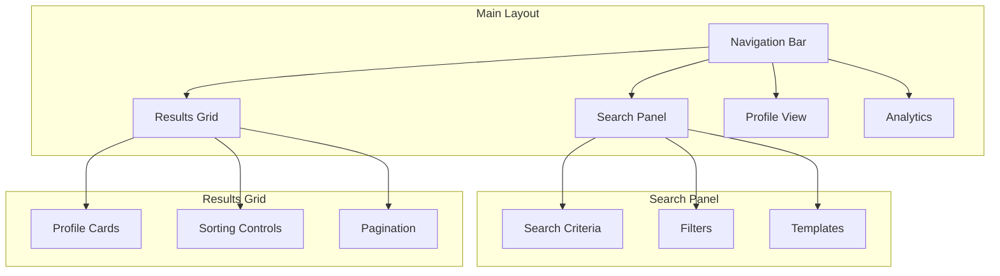

### 5.1.2 Component Specifications

| Component | Description | Interactions |
|-----------|-------------|--------------|
| Search Panel | Left-aligned collapsible panel | Expandable filters, drag-drop criteria |
| Results Grid | Responsive card/list view | Infinite scroll, quick actions |
| Profile View | Right-aligned detail panel | Tabbed sections, floating actions |
| Analytics Dashboard | Full-width data visualization | Interactive charts, date ranges |

### 5.1.3 Responsive Breakpoints

| Breakpoint | Layout Changes | Target Devices |
|------------|----------------|----------------|
| < 768px | Single column, stacked panels | Mobile phones |
| 768px - 1024px | Two-column, collapsible panels | Tablets |
| > 1024px | Three-column, fixed panels | Desktop |

## 5.2 DATABASE DESIGN

### 5.2.1 Schema Architecture

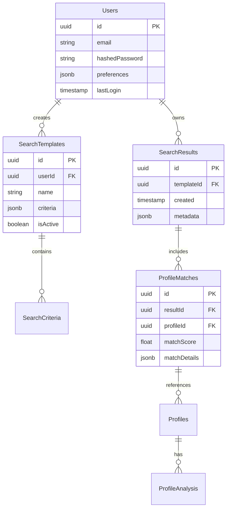

### 5.2.2 Data Partitioning Strategy

| Partition Type | Data Category | Retention Policy |
|----------------|---------------|------------------|
| Time-based | Profile Data | 2 years active, archive after |
| Hash-based | User Data | No expiration |
| Range-based | Analysis Results | 1 year active, archive after |

## 5.3 API DESIGN

### 5.3.1 REST Endpoints

| Endpoint | Method | Purpose | Request Format |
|----------|--------|---------|----------------|
| /api/v1/search | POST | Create search | JSON criteria |
| /api/v1/profiles | GET | List profiles | Query parameters |
| /api/v1/analysis | POST | Analyze profile | JSON profile data |
| /api/v1/export | GET | Export results | Query parameters |

### 5.3.2 API Flow Architecture

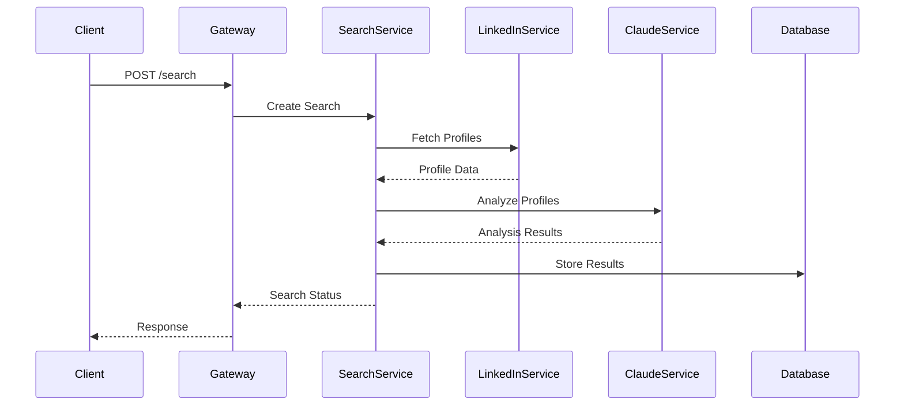

### 5.3.3 WebSocket Events

| Event | Direction | Purpose | Payload |
|-------|-----------|---------|---------|
| search.started | Server->Client | Search initiation | Search ID |
| profile.found | Server->Client | New profile match | Profile summary |
| analysis.complete | Server->Client | Analysis done | Analysis results |
| search.complete | Server->Client | Search finished | Final statistics |

### 5.3.4 Error Handling

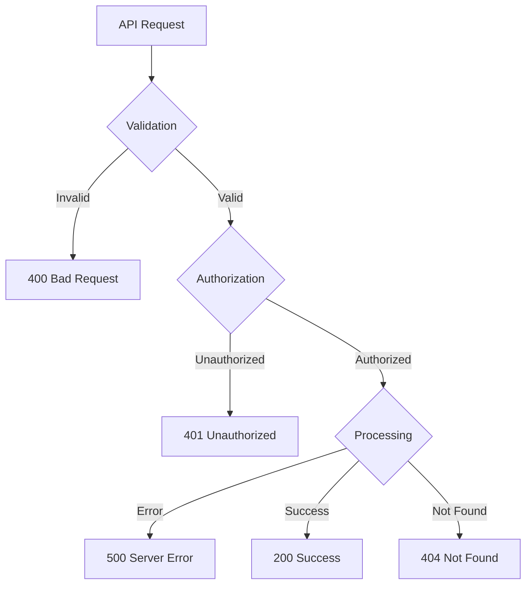

## 5.4 SECURITY DESIGN

### 5.4.1 Authentication Flow

```mermaid
sequenceDiagram
    participant User
    participant Frontend
    participant Auth
    participant API
    
    User->>Frontend: Login Request
    Frontend->>Auth: Authenticate
    Auth-->>Frontend: JWT Token
    Frontend->>API: Request + JWT
    API->>Auth: Validate Token
    Auth-->>API: Token Valid
    API-->>Frontend: Protected Resource
    Frontend-->>User: Display Data
```

### 5.4.2 Data Protection

| Layer | Protection Mechanism | Implementation |
|-------|---------------------|----------------|
| Transport | TLS 1.3 | HTTPS endpoints |
| Storage | AES-256 | Encrypted database |
| Application | HMAC | Request signing |
| Session | JWT | Token-based auth |

## 5.5 MONITORING DESIGN

```mermaid
flowchart LR
    subgraph Metrics Collection
        A[Application Metrics] --> B[Prometheus]
        C[System Metrics] --> B
        D[Custom Metrics] --> B
    end
    
    subgraph Visualization
        B --> E[Grafana]
        F[Logs] --> G[Kibana]
    end
    
    subgraph Alerting
        E --> H[Alert Manager]
        G --> I[Alert Rules]
    end
```

# 6. USER INTERFACE DESIGN

## 6.1 Interface Components Key

```
Icons:
[?] - Help/Documentation
[$] - Payment/Billing
[i] - Information
[+] - Add New/Create
[x] - Close/Delete
[<] [>] - Navigation
[^] - Upload
[#] - Menu/Dashboard
[@] - User Profile
[!] - Alert/Warning
[=] - Settings
[*] - Favorite/Important

Input Elements:
[ ] - Checkbox
( ) - Radio Button
[Button] - Action Button
[...] - Text Input Field
[====] - Progress Bar
[v] - Dropdown Menu
```

## 6.2 Main Dashboard Layout

```
+----------------------------------------------------------+
|  [#] LinkedIn Profile Search      [@] Admin    [?] Help   |
+----------------------------------------------------------+
|                                                          |
|  +----------------+  +--------------------------------+  |
|  |  Search        |  |  Results (24 profiles found)   |  |
|  |  Parameters    |  |                                |  |
|  |                |  |  [Sort by: Relevance [v]]      |  |
|  |  Keywords:     |  |                                |  |
|  |  [...]         |  |  +------------------------+    |  |
|  |                |  |  | [@] John Smith         |    |  |
|  |  Location:     |  |  | Senior Developer       |    |  |
|  |  [...]         |  |  | Match Score: 92%       |    |  |
|  |                |  |  | [View] [*] [x]         |    |  |
|  |  Experience:   |  |  +------------------------+    |  |
|  |  [ ] 0-2 yrs   |  |                                |  |
|  |  [ ] 3-5 yrs   |  |  +------------------------+    |  |
|  |  [ ] 5+ yrs    |  |  | [@] Sarah Jones        |    |  |
|  |                |  |  | Tech Lead              |    |  |
|  |  Skills:       |  |  | Match Score: 88%       |    |  |
|  |  [+] Add       |  |  | [View] [*] [x]         |    |  |
|  |                |  |  +------------------------+    |  |
|  |  [Search]      |  |                                |  |
|  +----------------+  |  [< Prev] Page 1 of 3 [Next >] |  |
|                     +--------------------------------+  |
+----------------------------------------------------------+
```

## 6.3 Profile Detail View

```
+----------------------------------------------------------+
|  [<] Back to Results                         [Export] [*]  |
+----------------------------------------------------------+
|                                                           |
|  +-------------------+  +----------------------------+    |
|  | [@] Profile Image |  | John Smith                |    |
|  |                   |  | Senior Developer          |    |
|  |                   |  | San Francisco, CA         |    |
|  |                   |  | Match Score: 92%          |    |
|  +-------------------+  +----------------------------+    |
|                                                          |
|  [Experience] [Skills] [Education] [Analysis]            |
|  +--------------------------------------------------+   |
|  | Current Role                                      |   |
|  | +-----------------------------------------------+|   |
|  | | Tech Lead at Example Corp                     ||   |
|  | | 2020 - Present                               ||   |
|  | | [i] AI Analysis Score: 95%                   ||   |
|  | +-----------------------------------------------+|   |
|  |                                                  |   |
|  | Skills Match                                     |   |
|  | [========] Python (90%)                          |   |
|  | [=======] Java (85%)                            |   |
|  | [========] AWS (92%)                             |   |
|  |                                                  |   |
|  | [!] Top Match Indicators:                        |   |
|  | - 8 years relevant experience                    |   |
|  | - Key skill alignment                            |   |
|  | - Industry background                            |   |
|  +--------------------------------------------------+   |
|                                                          |
|  [Contact] [Save Profile] [Generate Report]              |
+----------------------------------------------------------+
```

## 6.4 Search Configuration

```
+----------------------------------------------------------+
|  Search Template Configuration            [Save] [Cancel]  |
+----------------------------------------------------------+
|                                                           |
|  Template Name: [............................]            |
|                                                           |
|  Search Criteria                                          |
|  +--------------------------------------------------+    |
|  | Keywords and Boolean Logic                        |    |
|  | [...................................................|    |
|  | [...................................................|    |
|  |                                                    |    |
|  | Location Requirements                              |    |
|  | ( ) Any Location                                  |    |
|  | ( ) Specific Location: [......................]    |    |
|  | ( ) Multiple Locations                            |    |
|  |                                                    |    |
|  | Experience Level                                   |    |
|  | [v] Minimum Years: [...]                          |    |
|  | [v] Maximum Years: [...]                          |    |
|  |                                                    |    |
|  | Required Skills                                    |    |
|  | [Python] [x]  [Java] [x]  [AWS] [x]  [+] Add     |    |
|  |                                                    |    |
|  | Nice to Have Skills                               |    |
|  | [Kubernetes] [x]  [React] [x]  [+] Add           |    |
|  +--------------------------------------------------+    |
|                                                           |
|  [?] Syntax Guide  [Preview Results]                      |
+----------------------------------------------------------+
```

## 6.5 Analytics Dashboard

```
+----------------------------------------------------------+
|  Search Analytics                    [Export] [Date Range] |
+----------------------------------------------------------+
|                                                           |
|  Key Metrics                                              |
|  +----------------+ +----------------+ +----------------+  |
|  | Total Searches | | Profiles Found | | Avg Match %   |  |
|  |     1,234      | |    12,456     | |     84%       |  |
|  +----------------+ +----------------+ +----------------+  |
|                                                           |
|  Search Performance                                       |
|  +--------------------------------------------------+   |
|  |                                                   |   |
|  |    ^                                             |   |
|  |    |                     *     *                 |   |
|  |    |         *     *          *     *           |   |
|  |    |    *                                       |   |
|  |    +------------------------------------->      |   |
|  |        Mon  Tue  Wed  Thu  Fri  Sat  Sun       |   |
|  |                                                 |   |
|  +--------------------------------------------------+   |
|                                                          |
|  Top Search Terms                                        |
|  +--------------------------------------------------+   |
|  | 1. Python Developer     (234 searches)            |   |
|  | 2. AWS Engineer        (189 searches)            |   |
|  | 3. Full Stack          (156 searches)            |   |
|  | 4. Machine Learning    (134 searches)            |   |
|  +--------------------------------------------------+   |
+----------------------------------------------------------+
```

## 6.6 Responsive Design Breakpoints

| Breakpoint | Layout Changes |
|------------|----------------|
| < 768px | Single column, stacked panels |
| 768px - 1024px | Two-column, collapsible search |
| > 1024px | Three-column, fixed panels |

## 6.7 Component Specifications

| Component | Framework | Styling |
|-----------|-----------|---------|
| Layout Grid | MUI Grid | Flexbox |
| Data Tables | MUI DataGrid | Custom theme |
| Charts | Recharts | Material design |
| Forms | Formik + Yup | MUI components |
| Icons | Material Icons | SVG with themes |

## 6.8 Accessibility Requirements

- WCAG 2.1 AA compliance
- Keyboard navigation support
- Screen reader compatibility
- Color contrast ratios > 4.5:1
- Focus indicators
- ARIA labels and roles
- Alt text for images

# 7. SECURITY CONSIDERATIONS

## 7.1 AUTHENTICATION AND AUTHORIZATION

```mermaid
flowchart TD
    A[User Access Request] --> B{Authentication}
    B -->|Success| C[JWT Token Generation]
    B -->|Failure| D[Access Denied]
    C --> E{Authorization}
    E -->|Role Check| F[Access Control]
    F -->|Permitted| G[Resource Access]
    F -->|Denied| H[Permission Error]
```

| Authentication Method | Implementation | Purpose |
|----------------------|----------------|----------|
| OAuth 2.0 | Auth0 Integration | SSO and Identity Management |
| MFA | Time-based OTP | Additional Security Layer |
| JWT | JSON Web Tokens | Stateless Session Management |
| API Keys | SHA-256 Hashed | Service Authentication |

### Role-Based Access Control (RBAC)

| Role | Permissions | Access Level |
|------|------------|--------------|
| Admin | Full system access | Create, Read, Update, Delete |
| Recruiter | Profile management | Create, Read, Update |
| Hiring Manager | View and analyze | Read |
| API Service | Automated operations | Create, Read |

## 7.2 DATA SECURITY

```mermaid
flowchart LR
    subgraph Data At Rest
        A[AES-256 Encryption] --> B[Encrypted Storage]
        B --> C[Key Management]
    end
    
    subgraph Data In Transit
        D[TLS 1.3] --> E[Certificate Management]
        E --> F[Perfect Forward Secrecy]
    end
    
    subgraph Data Processing
        G[Memory Encryption] --> H[Secure Compute]
        H --> I[Data Masking]
    end
```

### Encryption Standards

| Data State | Encryption Method | Key Management |
|------------|------------------|----------------|
| At Rest | AES-256-GCM | AWS KMS |
| In Transit | TLS 1.3 | Let's Encrypt |
| In Memory | Secure Enclave | Hardware Security Module |
| Backups | AES-256-CBC | Offline Master Key |

### Data Classification

| Level | Description | Security Measures |
|-------|-------------|------------------|
| High Sensitivity | PII, Authentication Data | Encryption, Access Logging |
| Medium Sensitivity | Profile Data | Encryption, Role-Based Access |
| Low Sensitivity | Public Data | Standard Protection |

## 7.3 SECURITY PROTOCOLS

### Network Security

```mermaid
flowchart TD
    subgraph Edge Security
        A[WAF] --> B[DDoS Protection]
        B --> C[Rate Limiting]
    end
    
    subgraph Application Security
        D[Input Validation] --> E[XSS Prevention]
        E --> F[CSRF Protection]
    end
    
    subgraph Infrastructure Security
        G[Network Segmentation] --> H[Firewall Rules]
        H --> I[IDS/IPS]
    end
```

### Security Controls

| Control Type | Implementation | Update Frequency |
|--------------|----------------|------------------|
| WAF | AWS WAF | Real-time |
| DDoS Protection | CloudFlare | Continuous |
| Rate Limiting | Redis + API Gateway | Per-minute basis |
| Vulnerability Scanning | Nessus | Weekly |
| Penetration Testing | Third-party | Quarterly |

### Security Monitoring

| Component | Tool | Alert Threshold |
|-----------|------|----------------|
| Log Analysis | ELK Stack | Critical Events |
| Intrusion Detection | Snort | Suspicious Activity |
| Access Monitoring | Datadog | Failed Attempts |
| Certificate Monitoring | Cert Manager | 30 Days Before Expiry |

### Compliance Requirements

| Standard | Requirement | Implementation |
|----------|-------------|----------------|
| GDPR | Data Protection | Encryption, Access Controls |
| SOC 2 | Security Controls | Audit Logging, Monitoring |
| ISO 27001 | Information Security | Policy Enforcement |
| CCPA | Privacy Protection | Data Handling Procedures |

### Incident Response

```mermaid
flowchart LR
    A[Detection] -->|Alert| B[Assessment]
    B -->|Analyze| C[Containment]
    C -->|Mitigate| D[Eradication]
    D -->|Resolve| E[Recovery]
    E -->|Document| F[Post-Mortem]
    F -->|Update| A
```

| Phase | Actions | Responsible Team |
|-------|---------|-----------------|
| Detection | Monitor alerts | Security Operations |
| Assessment | Analyze impact | Security Team |
| Containment | Isolate threat | DevOps + Security |
| Recovery | Restore services | Operations Team |
| Post-Mortem | Document lessons | All Teams |

# 8. INFRASTRUCTURE

## 8.1 DEPLOYMENT ENVIRONMENT

```mermaid
flowchart TD
    subgraph Production
        A[AWS Cloud] --> B[Multi-AZ Deployment]
        B --> C[Primary Region: US-West-2]
        B --> D[DR Region: US-East-1]
    end
    
    subgraph Staging
        E[AWS Cloud] --> F[Single-AZ Deployment]
        F --> G[Region: US-West-2]
    end
    
    subgraph Development
        H[AWS Cloud] --> I[Development Environment]
        I --> J[Region: US-West-2]
    end
```

| Environment | Purpose | Configuration |
|------------|---------|---------------|
| Production | Live system | Multi-AZ, Auto-scaling, High Availability |
| Staging | Pre-production testing | Single-AZ, Fixed capacity |
| Development | Development and testing | Single-AZ, Minimal resources |
| DR | Disaster Recovery | Multi-AZ, Warm standby |

## 8.2 CLOUD SERVICES

| Service | Purpose | Configuration |
|---------|---------|---------------|
| AWS EKS | Kubernetes management | v1.27+, managed node groups |
| AWS RDS | PostgreSQL database | Multi-AZ, r6g.xlarge |
| AWS ElastiCache | Redis caching | Cluster mode, r6g.large |
| AWS DocumentDB | MongoDB compatible | Replica set, r6g.large |
| AWS S3 | Object storage | Standard + Glacier |
| AWS CloudFront | CDN | Global edge locations |
| AWS Route53 | DNS management | Active-active routing |
| AWS WAF | Web application firewall | Regional rules |

## 8.3 CONTAINERIZATION

```mermaid
flowchart LR
    subgraph Base Images
        A[Node 18-Alpine] --> B[Web App]
        C[Python 3.11-Slim] --> D[Search Service]
        E[Java 17-Alpine] --> F[Data Service]
    end
    
    subgraph Container Registry
        G[ECR] --> H[Production Images]
        G --> I[Staging Images]
    end
```

| Component | Base Image | Resource Limits |
|-----------|------------|-----------------|
| Web Frontend | node:18-alpine | 1CPU, 2GB RAM |
| API Gateway | node:18-alpine | 2CPU, 4GB RAM |
| Search Service | python:3.11-slim | 2CPU, 4GB RAM |
| Analysis Service | python:3.11-slim | 4CPU, 8GB RAM |
| Data Service | java:17-alpine | 2CPU, 4GB RAM |

## 8.4 ORCHESTRATION

```mermaid
flowchart TD
    subgraph EKS Cluster
        A[Ingress Controller] --> B[Service Mesh]
        B --> C[Application Pods]
        B --> D[Background Jobs]
    end
    
    subgraph Node Groups
        E[System Nodes] --> F[Application Nodes]
        F --> G[Worker Nodes]
    end
```

| Component | Configuration | Scaling Policy |
|-----------|--------------|----------------|
| EKS Control Plane | v1.27+ | Managed by AWS |
| Node Groups | t3.large | Auto-scaling (2-10 nodes) |
| Service Mesh | Istio 1.20+ | N/A |
| Ingress | NGINX Ingress 1.9+ | Auto-scaling |
| Monitoring | Prometheus/Grafana | Fixed capacity |

## 8.5 CI/CD PIPELINE

```mermaid
flowchart LR
    subgraph CI Pipeline
        A[GitHub] --> B[Actions Runner]
        B --> C[Unit Tests]
        C --> D[Integration Tests]
        D --> E[Security Scan]
        E --> F[Build Images]
    end
    
    subgraph CD Pipeline
        F --> G[Push to ECR]
        G --> H[ArgoCD Sync]
        H --> I[Staging Deploy]
        I --> J[Production Deploy]
    end
```

| Stage | Tool | Configuration |
|-------|------|---------------|
| Source Control | GitHub | Protected branches |
| CI Runner | GitHub Actions | Self-hosted runners |
| Testing | Jest/PyTest | Parallel execution |
| Security | Snyk/SonarQube | Fail on high severity |
| Registry | AWS ECR | Image scanning enabled |
| Deployment | ArgoCD | GitOps workflow |
| Monitoring | Datadog | Full pipeline visibility |

### Deployment Strategy

| Environment | Strategy | Rollback Time |
|-------------|----------|---------------|
| Production | Blue-Green | < 5 minutes |
| Staging | Rolling Update | < 2 minutes |
| Development | Direct Update | Immediate |

### Pipeline Metrics

| Metric | Target | Alert Threshold |
|--------|--------|----------------|
| Build Time | < 10 minutes | > 15 minutes |
| Test Coverage | > 80% | < 75% |
| Deployment Time | < 15 minutes | > 30 minutes |
| Rollback Success | 100% | < 99% |

# 9. APPENDICES

## 9.1 ADDITIONAL TECHNICAL INFORMATION

### Development Environment Setup

```mermaid
flowchart TD
    subgraph Local Development
        A[VS Code] --> B[ESLint + Prettier]
        B --> C[Git Hooks]
        C --> D[Local Docker]
    end
    
    subgraph Testing Environment
        E[Jest] --> F[PyTest]
        F --> G[JUnit]
        G --> H[Integration Tests]
    end
    
    subgraph Build Tools
        I[npm/yarn] --> J[pip]
        J --> K[Maven]
        K --> L[Docker Compose]
    end
```

### System Dependencies Matrix

| Component | Primary Dependencies | Secondary Dependencies |
|-----------|---------------------|----------------------|
| Frontend | React 18+, MUI 5+ | Redux Toolkit, React Query |
| API Gateway | Node.js 18+, Express 4+ | JWT, Passport |
| Search Service | Python 3.11+, FastAPI | BeautifulSoup4, Scrapy |
| Analysis Service | Python 3.11+, Claude SDK | NumPy, Pandas |
| Data Service | Java 17+, Spring Boot 3+ | Hibernate, Flyway |

## 9.2 GLOSSARY

| Term | Definition |
|------|------------|
| Applicant Tracking System | Software application that handles recruitment and hiring processes |
| Blue-Green Deployment | Deployment strategy using two identical environments for zero-downtime updates |
| Circuit Breaker | Design pattern that prevents cascading failures in distributed systems |
| CQRS | Command Query Responsibility Segregation - pattern separating read and write operations |
| GitOps | Operational framework that takes DevOps practices and applies them to infrastructure automation |
| Idempotency | Property where an operation can be applied multiple times without changing the result |
| Service Mesh | Infrastructure layer for facilitating service-to-service communications |
| Warm Standby | Disaster recovery configuration where backup systems are kept running but idle |

## 9.3 ACRONYMS

| Acronym | Full Form |
|---------|-----------|
| AES | Advanced Encryption Standard |
| APM | Application Performance Monitoring |
| CDN | Content Delivery Network |
| CORS | Cross-Origin Resource Sharing |
| DDoS | Distributed Denial of Service |
| ELK | Elasticsearch, Logstash, and Kibana |
| gRPC | Google Remote Procedure Call |
| HRIS | Human Resource Information System |
| IDS | Intrusion Detection System |
| IPS | Intrusion Prevention System |
| JWT | JSON Web Token |
| MFA | Multi-Factor Authentication |
| ORM | Object-Relational Mapping |
| PII | Personally Identifiable Information |
| SDK | Software Development Kit |
| SLA | Service Level Agreement |
| SSO | Single Sign-On |
| WAF | Web Application Firewall |
| XSS | Cross-Site Scripting |

## 9.4 REFERENCE ARCHITECTURE

```mermaid
flowchart TD
    subgraph Frontend Tier
        A[React SPA] --> B[Redux Store]
        B --> C[API Client]
    end
    
    subgraph API Tier
        D[API Gateway] --> E[Service Mesh]
        E --> F[Microservices]
    end
    
    subgraph Data Tier
        G[PostgreSQL] --> H[MongoDB]
        H --> I[Redis]
        I --> J[Elasticsearch]
    end
    
    subgraph External Services
        K[LinkedIn API] --> L[Claude AI]
        L --> M[Cloud Services]
    end
```

## 9.5 COMPLIANCE MATRIX

| Requirement | Implementation | Verification Method |
|-------------|----------------|-------------------|
| GDPR Art. 25 | Data encryption, access controls | Security audit |
| SOC 2 Type II | Monitoring, logging, security controls | External audit |
| ISO 27001 | Information security management | Certification |
| CCPA | Data handling, privacy controls | Compliance review |
| LinkedIn ToS | Rate limiting, data usage policies | Automated checks |