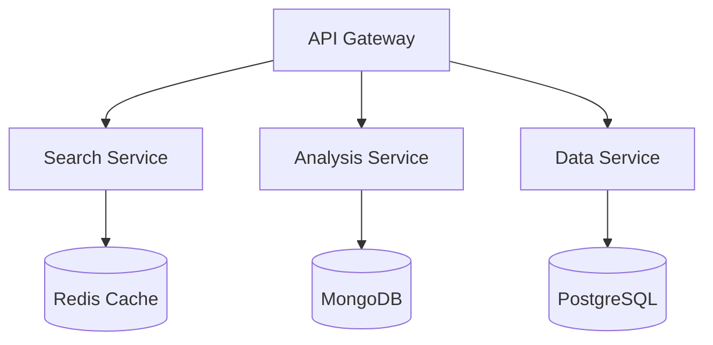
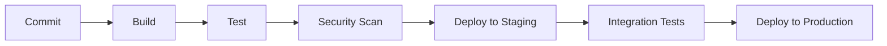

# LinkedIn Profile Search and Analysis System - Backend Services

## Table of Contents
- [System Overview](#system-overview)
- [Architecture](#architecture)
- [Services](#services)
- [Setup and Installation](#setup-and-installation)
- [Development Guidelines](#development-guidelines)
- [Security](#security)
- [Operations](#operations)
- [Troubleshooting](#troubleshooting)

## System Overview

The LinkedIn Profile Search and Analysis System backend is a microservices-based architecture designed for high scalability, reliability, and maintainability. The system processes LinkedIn profiles through intelligent search and AI-powered analysis to support automated recruitment workflows.

### Key Features
- Distributed microservices architecture
- Real-time profile search and analysis
- AI-powered candidate evaluation
- Secure data handling and storage
- Enterprise-grade scalability
- Comprehensive monitoring and logging

## Architecture

### Microservices Components


### Service Communication
- gRPC for inter-service communication
- Event-driven architecture using Apache Kafka
- Circuit breaker pattern implementation
- Distributed tracing with Jaeger

## Services

### API Gateway Service
- **Technology**: Node.js 18 LTS
- **Framework**: Express 4.18+
- **Key Dependencies**:
  - TypeScript 5.0+
  - JWT for authentication
  - Rate limiting middleware
- **Responsibilities**:
  - Request routing
  - Authentication/Authorization
  - Rate limiting
  - Request validation
  - Response caching

### Search Service
- **Technology**: Python 3.11+
- **Framework**: FastAPI
- **Key Dependencies**:
  - Scrapy for profile extraction
  - BeautifulSoup4 for parsing
  - Redis for caching
- **Responsibilities**:
  - LinkedIn profile search
  - Data extraction
  - Rate limit management
  - Cache optimization

### Analysis Service
- **Technology**: Python 3.11+
- **Framework**: FastAPI
- **Key Dependencies**:
  - Claude AI SDK
  - NumPy/Pandas for data processing
- **Responsibilities**:
  - Profile analysis
  - Skill mapping
  - Candidate scoring
  - Async processing

### Data Service
- **Technology**: Java 17 LTS
- **Framework**: Spring Boot 3.1+
- **Key Dependencies**:
  - PostgreSQL 15+
  - MongoDB 6.0+
  - Hibernate ORM
- **Responsibilities**:
  - Data persistence
  - CQRS implementation
  - Transaction management
  - Data validation

## Setup and Installation

### Prerequisites
```bash
# Node.js 18 LTS
curl -fsSL https://deb.nodesource.com/setup_18.x | sudo -E bash -
sudo apt-get install -y nodejs

# Python 3.11
sudo apt-get install python3.11 python3.11-dev

# Java 17 LTS
sudo apt-get install openjdk-17-jdk

# Docker and Docker Compose
sudo apt-get install docker-ce docker-compose
```

### Development Environment Setup
```bash
# Clone repository
git clone <repository-url>
cd src/backend

# Install dependencies
./scripts/install-dependencies.sh

# Configure environment
cp .env.example .env
# Edit .env with your configuration

# Start services
docker-compose up -d
```

## Development Guidelines

### Code Style
- Follow language-specific style guides:
  - JavaScript/TypeScript: Airbnb style guide
  - Python: PEP 8
  - Java: Google Java Style Guide

### Testing Requirements
- Unit test coverage: minimum 80%
- Integration tests for all API endpoints
- Performance tests for critical paths
- Security testing integration

### CI/CD Pipeline


## Security

### Authentication
- JWT-based authentication
- OAuth 2.0 integration
- Role-based access control (RBAC)
- Multi-factor authentication support

### Data Protection
- AES-256 encryption at rest
- TLS 1.3 for data in transit
- PII data handling compliance
- Regular security audits

### Compliance
- GDPR compliance
- SOC 2 Type II controls
- ISO 27001 standards
- CCPA requirements

## Operations

### Monitoring
- Prometheus for metrics collection
- Grafana for visualization
- ELK stack for log aggregation
- Custom alerting rules

### Scaling Strategy
- Horizontal scaling for all services
- Auto-scaling based on metrics
- Load balancing configuration
- Cache optimization

### Backup and Recovery
- Automated daily backups
- Point-in-time recovery
- Cross-region replication
- Disaster recovery procedures

## Troubleshooting

### Common Issues
1. Service Communication
   - Check network connectivity
   - Verify service discovery
   - Validate authentication
   - Review rate limits

2. Performance Issues
   - Monitor resource usage
   - Check database queries
   - Analyze cache hit rates
   - Review service logs

### Performance Optimization
- Query optimization guidelines
- Caching strategies
- Resource allocation recommendations
- Scaling thresholds

## API Documentation
Detailed API documentation is available at:
- Development: http://localhost:8080/api-docs
- Staging: https://api-staging.example.com/api-docs
- Production: https://api.example.com/api-docs

## Contributing
Please refer to CONTRIBUTING.md for detailed guidelines on:
- Code submission process
- Review requirements
- Testing guidelines
- Documentation standards

## License
Copyright © 2024 LinkedIn Profile Search and Analysis System