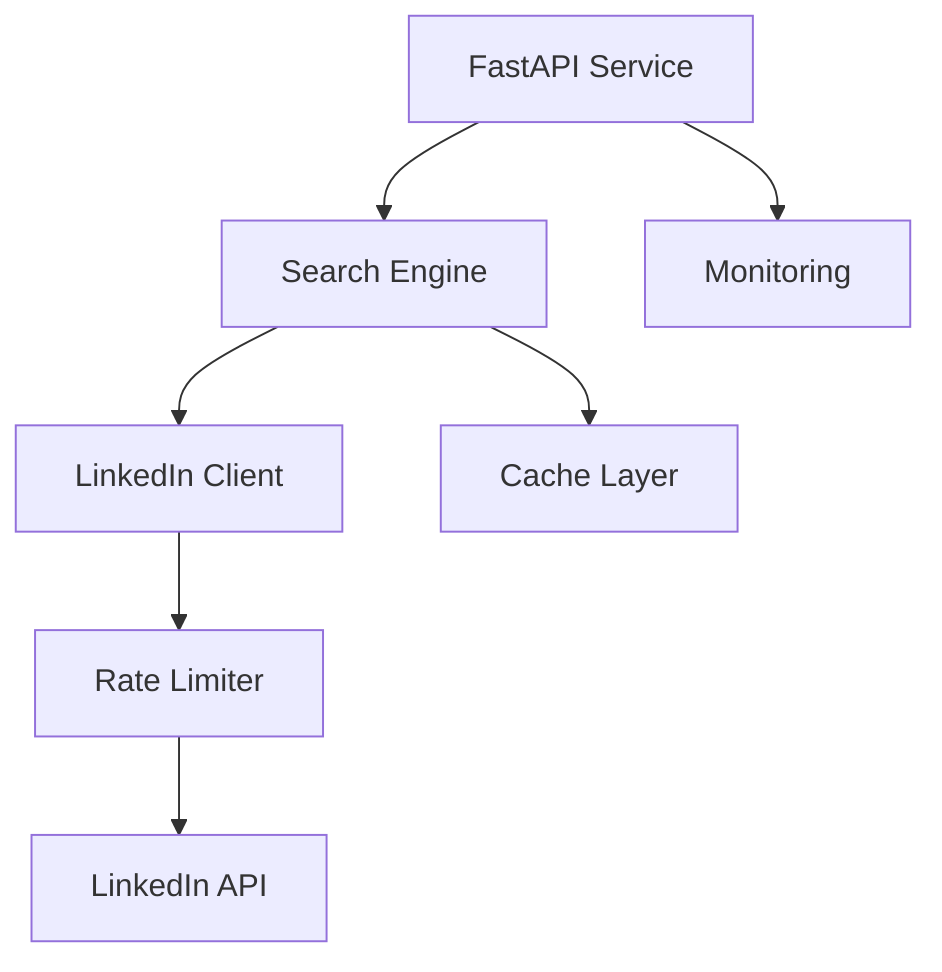

# LinkedIn Profile Search Service

A high-performance, scalable service for automated LinkedIn profile discovery, data extraction, and advanced search functionality.

## Overview

The LinkedIn Profile Search Service is a core component of the recruitment automation platform that provides:

- Automated LinkedIn profile discovery and extraction
- Advanced boolean search capabilities
- Configurable search templates
- Rate-limited API interactions
- Comprehensive data extraction (experience, skills, education, certifications)
- Production-ready scalability and reliability

## Architecture

### Core Components



- **FastAPI Service**: High-performance API layer (v0.100+)
- **Search Engine**: Core search implementation
- **LinkedIn Client**: Rate-limited API client
- **Cache Layer**: Profile data caching
- **Monitoring**: Telemetry and observability

## Installation

### Prerequisites

- Python 3.11+
- Docker (for containerized deployment)
- LinkedIn API credentials

### Local Setup

```bash
# Create virtual environment
python -m venv venv
source venv/bin/activate  # Linux/Mac
.\venv\Scripts\activate   # Windows

# Install dependencies
pip install -r requirements.txt

# Configure environment
cp .env.example .env
# Edit .env with your LinkedIn API credentials
```

### Docker Setup

```bash
# Build container
docker build -t linkedin-search-service:latest .

# Run container
docker run -d \
  -p 8000:8000 \
  -e LINKEDIN_API_KEY=your_api_key \
  -e LINKEDIN_API_SECRET=your_api_secret \
  linkedin-search-service:latest
```

## Configuration

### Environment Variables

| Variable | Description | Required | Default |
|----------|-------------|----------|---------|
| LINKEDIN_API_KEY | LinkedIn API authentication key | Yes | - |
| LINKEDIN_API_SECRET | LinkedIn API secret | Yes | - |
| RATE_LIMIT_REQUESTS | Max API requests per window | No | 100 |
| RATE_LIMIT_WINDOW | Rate limit window (seconds) | No | 3600 |
| CACHE_TTL | Cache TTL (seconds) | No | 86400 |
| LOG_LEVEL | Logging level | No | INFO |

### API Rate Limiting

The service implements intelligent rate limiting to comply with LinkedIn API quotas:

```python
# Example rate limit configuration
RATE_LIMIT_CONFIG = {
    "requests": int(os.getenv("RATE_LIMIT_REQUESTS", "100")),
    "window": int(os.getenv("RATE_LIMIT_WINDOW", "3600")),
    "strategy": "sliding_window"
}
```

## API Documentation

### Search Endpoints

```python
# Example search request
POST /api/v1/search
{
    "keywords": "python developer",
    "location": "San Francisco",
    "experience_years": [3, 5],
    "skills": ["Python", "AWS", "Docker"],
    "template_id": "optional-template-uuid"
}
```

### Profile Extraction

```python
# Example profile extraction
GET /api/v1/profiles/{profile_id}
```

Full API documentation available at `/docs` (Swagger UI) when service is running.

## Development

### Code Style

- Follow PEP 8 guidelines
- Use type hints
- Document all public interfaces
- Write unit tests for new features

### Testing

```bash
# Run unit tests
pytest

# Run with coverage
pytest --cov=src tests/
```

## Security

### Best Practices

- API keys stored in environment variables
- Rate limiting to prevent abuse
- Input validation on all endpoints
- Regular security dependency updates
- Comprehensive request logging

### Compliance

- Adheres to LinkedIn API Terms of Service
- Implements data privacy best practices
- Supports audit logging

## Deployment

### Kubernetes Deployment

```yaml
# Example Kubernetes deployment
apiVersion: apps/v1
kind: Deployment
metadata:
  name: linkedin-search-service
spec:
  replicas: 3
  template:
    spec:
      containers:
      - name: search-service
        image: linkedin-search-service:latest
        env:
          - name: LINKEDIN_API_KEY
            valueFrom:
              secretKeyRef:
                name: linkedin-credentials
                key: api-key
```

### Monitoring

- Prometheus metrics exposed on `/metrics`
- Grafana dashboards for visualization
- Alert rules for error rates and latency
- Detailed logging with correlation IDs

## Troubleshooting

### Common Issues

1. Rate Limiting
   - Check `RATE_LIMIT_*` configurations
   - Monitor rate limit metrics
   - Implement exponential backoff

2. API Authentication
   - Verify API credentials
   - Check token expiration
   - Monitor auth failure metrics

### Logging

```python
# Example log output
2023-08-10T10:15:30Z INFO [search-service] Search request received correlation_id=abc123
2023-08-10T10:15:31Z DEBUG [linkedin-client] API request successful status=200
```

### Support

- GitHub Issues: Report bugs and feature requests
- Documentation: [Internal Wiki Link]
- Team Chat: #search-service-support

## Dependencies

Key dependencies and versions:

- Python (3.11+)
- FastAPI (0.100+)
- aiohttp (3.8.0)
- backoff (2.2.0)
- ratelimit (2.2.1)
- uvicorn (0.23.0)
- pydantic (2.0+)

## License

Copyright © 2023. All rights reserved.