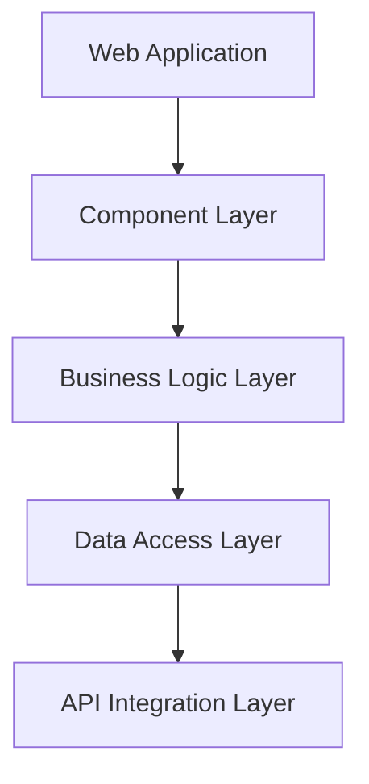

# LinkedIn Profile Search Frontend Application

Enterprise-grade React application for automated LinkedIn profile search, analysis, and recruitment optimization.

## Table of Contents
- [Overview](#overview)
- [Prerequisites](#prerequisites)
- [Getting Started](#getting-started)
- [Architecture](#architecture)
- [Development Guidelines](#development-guidelines)
- [Testing Strategy](#testing-strategy)
- [Deployment](#deployment)
- [Security & Compliance](#security--compliance)

## Overview

The LinkedIn Profile Search Frontend Application is an enterprise-level React application that provides a robust interface for recruiters and HR professionals to search, analyze, and evaluate LinkedIn profiles using AI-powered analysis.

### Key Features
- Advanced LinkedIn profile search with boolean logic
- AI-powered candidate evaluation and scoring
- Real-time profile analysis and matching
- Enterprise-grade security and compliance
- Comprehensive analytics dashboard
- Accessibility-first design approach

### Technology Stack
- React 18.2.0 - Enterprise UI library with strict mode
- TypeScript 5.0.0 - Strictly typed development
- MUI 5.14.0 - Enterprise component library
- Redux Toolkit 1.9.0 - Type-safe state management
- React Query 4.0.0 - Secure data fetching

## Prerequisites

### Required Software
- Node.js >= 18.0.0 LTS
- npm >= 9.0.0 or yarn >= 1.22.0
- VS Code (recommended IDE)

### VS Code Extensions
- ESLint
- Prettier
- TypeScript and JavaScript Language Features
- Jest Runner
- GitLens

### Environment Setup
Required environment variables:
```bash
VITE_API_URL=<secure-api-endpoint>        # Secure backend API URL
VITE_WS_URL=<secure-websocket-url>        # WebSocket server URL
VITE_ENV=<environment-name>               # Environment context
VITE_CSP_POLICY=<csp-configuration>       # Content Security Policy
```

## Getting Started

1. **Repository Access**
```bash
git clone <repository-url>
cd src/web
```

2. **Install Dependencies**
```bash
npm install
```

3. **Development Server**
```bash
npm run dev
```

4. **Available Scripts**
```bash
npm run dev            # Start development server with hot reload
npm run build         # Create optimized production build
npm run test          # Run test suite
npm run lint          # Run ESLint checks
npm run security-audit # Run security checks
```

## Architecture

### Frontend Architecture


### State Management
- Redux Toolkit for global state
- React Query for server state
- Context API for component state
- Strict TypeScript typing

### Component Structure
- Atomic Design methodology
- Strict prop typing
- HOC patterns for cross-cutting concerns
- Error boundary implementation

## Development Guidelines

### TypeScript Standards
- Strict mode enabled
- Explicit type declarations
- No any types
- Interface-first approach

### Component Development
- Functional components with hooks
- Props interface documentation
- Performance optimization
- Accessibility implementation

### Code Style
```typescript
// Component Example
interface ProfileCardProps {
  profile: LinkedInProfile;
  onAnalyze: (id: string) => Promise<void>;
}

const ProfileCard: React.FC<ProfileCardProps> = ({ profile, onAnalyze }) => {
  // Implementation
};
```

## Testing Strategy

### Unit Testing
- Jest + React Testing Library
- Component isolation
- State management testing
- API integration mocking

### Integration Testing
- User flow testing
- State integration
- API communication
- Error handling

### E2E Testing
- Cypress for critical paths
- User journey validation
- Performance metrics
- Accessibility testing

## Deployment

### Build Process
1. Security audit
2. Dependency validation
3. TypeScript compilation
4. Asset optimization
5. Bundle analysis

### Environment Configuration
```typescript
// vite.config.ts
export default defineConfig({
  build: {
    sourcemap: process.env.VITE_ENV !== 'production',
    minify: 'terser',
    terserOptions: {
      compress: {
        drop_console: process.env.VITE_ENV === 'production'
      }
    }
  }
});
```

### Production Checklist
- [ ] Security audit passed
- [ ] Performance benchmarks met
- [ ] Accessibility compliance
- [ ] Error tracking configured
- [ ] Monitoring setup complete

## Security & Compliance

### Security Measures
- Content Security Policy (CSP)
- Strict CORS policy
- XSS prevention
- CSRF protection
- Secure data handling

### GDPR Compliance
- Data minimization
- User consent management
- Data encryption
- Access controls
- Audit logging

### Security Best Practices
```typescript
// Security Headers Configuration
const securityHeaders = {
  'Content-Security-Policy': process.env.VITE_CSP_POLICY,
  'Strict-Transport-Security': 'max-age=31536000; includeSubDomains',
  'X-Content-Type-Options': 'nosniff',
  'X-Frame-Options': 'DENY',
  'X-XSS-Protection': '1; mode=block'
};
```

## Contributing

Please refer to our [Contributing Guidelines](CONTRIBUTING.md) for detailed information about our development process.

## License

This project is proprietary and confidential. Unauthorized copying or distribution is strictly prohibited.